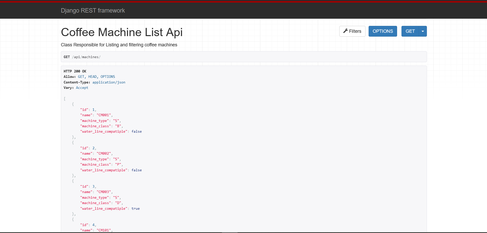
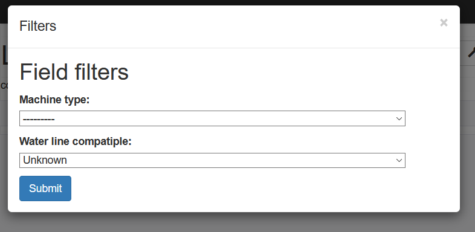
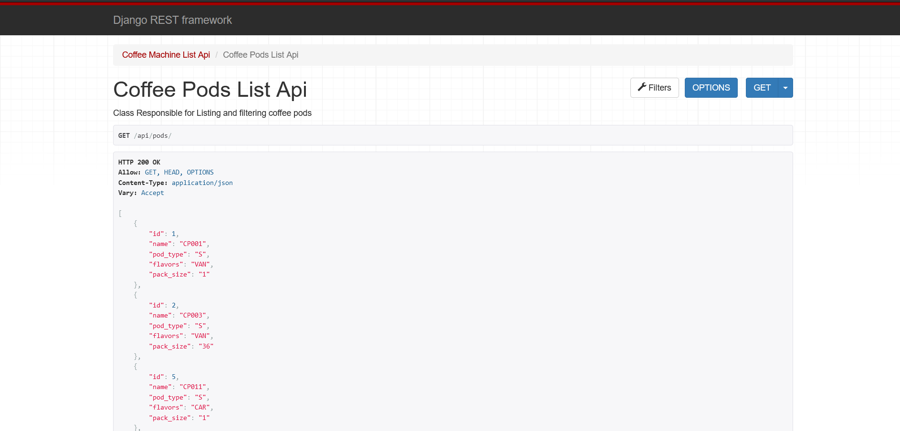
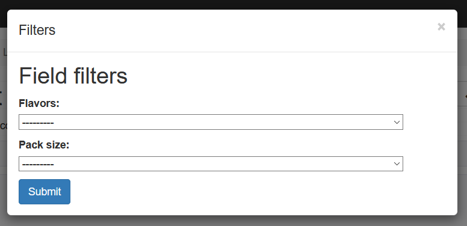

# backend-challenge
Simulate back-end of  e-commerce mobile application

#Notes
- I used flake8 as linter
- I have dumped the database into db.json so you can use it to fill the database
- I filled the database manually beacause the required only is to list items
- we can fill database automatically if we made full CRUD operations
by simple python script

# Screenshots

### Coffee Machine screen

### Coffee Machine filters

### Coffee pods screen

### Coffee pods filters

